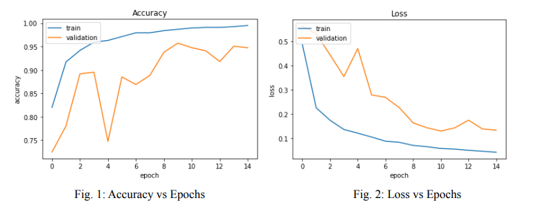

# COVID-19 Detection From X-Ray Images
The dataset used in this project can be found [here](https://www.kaggle.com/datasets/asraf047/covid19-pneumonia-normal-chest-xray-pa-dataset), which includes
images of X-Ray scans of 1525 patients with no covid diagnosis as well as X-Ray scans of around 400 patients with covid diagnosis. The imbalance between the two classes has been addressed in the dataset by including augmented images of patients with covid diagnosis. The augmented images have random zooms, some rotations and flips. In the end both the non-covid and covid classes have 1525 members each. Scaling and normalization operations are also applied to the images for better CNN performance. One from-scratch model and one transfer learning model was used and evaluated on the dataset.

## 1) From-Scratch Model

[Keras API](https://keras.io/) was used to build a model from scratch. The network architecture can be summarized as follows:
- Block 1:
  - Convolutional layer
  - Activation layer
  - Batch normalization layer
  - Max pooling layer
- Flatten layer
- Block 2:
  - Dense layer
  - Dropout layer
- Output layer

The convolutional layer increases the number of feature maps, then the ReLu activation
layer is applied to add non-linearity to be able to deal with non-linear input-output relationships.
We then normalize the batch after the activation layer. It is a topic of debate whether to use the
batch normalization before or after the activation layer. Some researchers suggest that using it
before helps, some suggest that it defeats the purpose of normalization to use it before the
activation layer. We used it after the activation layer in this part. Then we reduce the spatial
resolution with the pooling layer. We then use a flatten layer to flatten our multidimensional
output and reshape it to be 1 dimensional.

The output of the flatten layer is fed into the dense layers whose weights are
appropriately trained in the training. The dropout layer ignores some units in the dense layers
randomly. This has the effect of making the undropped nodes to take responsibility for those that
were dropped. In return, this makes the model more robust. We were careful not to stack batch
normalization layer and dropout layer together since a wrong ordering of batch normalization
and dropout layer would disturb the normalization and defeat its purpose.

In the final layer, we have a dense layer with 1 unit only followed by a sigmoid activation
function for binary classification.

Since it is not really possible to know exactly the best parameters for our architecture for the
problem at hand, we selected some parameters to tune our network. By incorporating a random
search on those parameters, we tried to find the best possible network for our classification
problem. The parameters we searched for and which part of the architecture they belong to are
listed in table 1.

#### Table 1:  Hyperparameters for the CNN

|  |  |  |
|---------------------|-----------------|-------------------------------------|
| Convolutional Layer | Number of Filters: [16, 32, 64] | Kernel Size: [1, 3] |
| Dense Layer | Number of Units: [8, 64, 128] |  |
| Dropout Layer | Use Dropout: [False, True] |  |
| Number of blocks: [1, 3] |  |  |
| Learning Rate: [1e-1, 1e-3] |  |  |

In the convolutional layer, we choose the number of filters and the filters’ kernel size. In
the dense layer, we choose the number of connected units to be used. In the dropout layer, we
decide whether or not we are going to use the dropout layer. Number of blocks determines the
number of times to repeat the blocks we defined before in the architecture (Block 1 and Block 2).
Learning rate determines the learning rate to be used in the training. Since we have a lot of
hyperparameters, we ran a random search to determine the best architecture. Our criterion was
the validation accuracy. The architecture with the best validation accuracy would be chosen as
the one we will use for the classification.

### Results

The results from the random search, the best 3 networks out of the 50 trials we ran, and
the evaluation of the best network on the test set will be presented in this section (see table 2).

#### Table 2: Best three CNN structures tuned with random search

|  | Results Summary-Showing Top 3 Trials |  |
|---------------------|-----------------|-------------------------------------|
| 1) Trial summary Hyperparameters: cnn_layers: 1 conv_filters0: 16 kernel_size0: 3 dropout: False dense_units0: 64 learning_rate: 0.001 Score: 0.9377049207687378| 2) Trial summary Hyperparameters: cnn_layers: 1 conv_filters0: 32 kernel_size0: 3 dropout: True dense_units0: 8 learning_rate: 0.001 Score: 0.9147540926933289| 3) Trial summary Hyperparameters: cnn_layers: 3 conv_filters0: 16 kernel_size0: 1 dropout: True  dense_units0: 64 learning_rate: 0.001 conv_filters1: 64 kernel_size1: 3 conv_filters2: 32 kernel_size2: 1 dense_units1: 128 dense_units2: 64 Score: 0.9049180150032043|

Figures 1 and 2 are the graphs and the statistics for the best network. Table 3 illustrates the
classification performance on the test set for from-scratch method.

#### Table 3: Classification Performance On the Test Set

|  | precision | recall | f1-score | support |
|--|--|--|--|--|
| 0 | 0.97 | 0.96 | 0.96 | 155 |
| 1 | 0.96 | 0.97 | 0.96 | 150 |

## 2) Transfer Learning

For the transfer learning algorithm, we used resnet18 and instead of random
initialization of the weights, we used the weights in the pretrained network. Although our dataset
is relatively small, we expected resnet18 to perform very well on it since the network has been
trained on millions of images. Table 4 represents the classification performance on the test set for
Resnet18.

#### Table 4: Resnet18 Classification Performance On the Test Set
|  | precision | recall | f1-score |
|--|--|--|--|
| 0 | 0.99 | 0.99 | 0.99 |
| 1 | 0.99 | 0.99 | 0.99 |
| accuracy |  |  | 0.99 |
| macro avg. | 0.99 | 0.99 | 0.99 |
| weighted avg. | 0.99 | 0.99 | 0.99 |

Resnet18 was able to classify the covid and non-covid patients almost without misclassification, however, it took longer to train it when compared to our from scratch model due to its depth and complexity.
